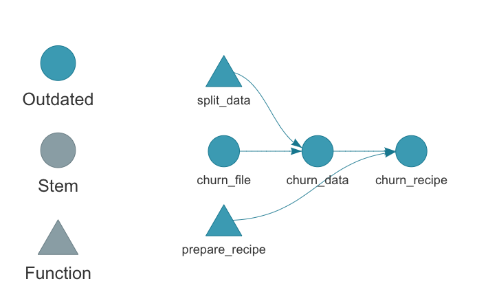
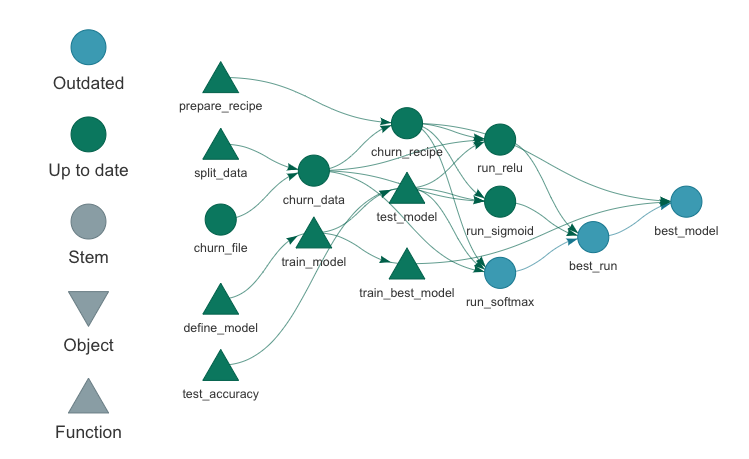
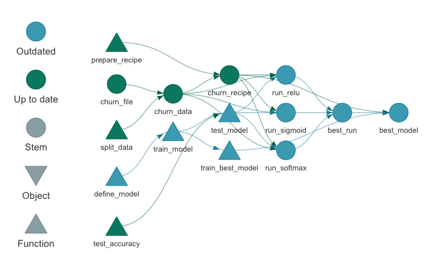
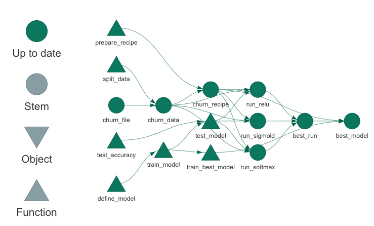

<style>
.inverse {
background-color: transparent;
text-shadow: 0 0 0px transparent;
}
.title-slide {
vertical-align: bottom !important; 
text-align: center !important;
}
.title-slide h1 {
position: absolute;
top: 0;
left: 0;
right: 0;
width: 100%;
line-height: 4em;
color: #666666;
}
.title-slide h3 {
line-height: 6em;
color: #666666;
}
.title-slide {
background-color: white;
background-image: url('images/logo.png');
background-repeat: no-repeat;
background-size: 25%;
}
.remark-slide-content:after {
content: "Copyright Eli Lilly and Company";
position: absolute;
bottom: -5px;
left: 10px;
height: 40px;
width: 100%;
font-family: Helvetica, Arial, sans-serif;
font-size: 0.7em;
color: gray;
background-repeat: no-repeat;
background-size: contain;
}
</style>

```{r, include = FALSE}
knitr::opts_chunk$set(
  collapse = TRUE,
  warning = FALSE,
  comment = "#>",
  fig.align = "center",
  fig.width = 10,
  fig.height = 7,
  out.width = "80%",
  out.height = "80%"
)
```

```{r, include = FALSE, message = FALSE}
options(
  warnPartialMatchArgs = FALSE,
  drake_clean_menu = FALSE,
  drake_make_menu = FALSE,
  htmltools.dir.version = FALSE
)
packages <- c(
  "targets",
  "keras",
  "recipes",
  "rsample",
  "tidyverse",
  "yardstick"
)
purrr::walk(
  packages,
  function(pkg) {
    suppressMessages(suppressWarnings(library(pkg, character.only = TRUE)))
  }
)
Sys.setenv(TAR_SCRIPT_ASK = "false")
tar_destroy()
```

## Large statistical computation

* [Bayesian data analysis](https://mc-stan.org/)
* [Bayesian network meta-analysis](https://bookdown.org/MathiasHarrer/Doing_Meta_Analysis_in_R/bayesian-network-meta-analysis.html)
* [Graph-based multiple comparison procedures](https://github.com/kornl/gMCP)
* [Subgroup identification](https://cran.r-project.org/web/packages/TSDT/index.html)
* [Predictive modeling](http://appliedpredictivemodeling.com/computing)
* [Deep neural networks](https://keras.rstudio.com/)
* [PK/PD modeling](https://github.com/nlmixrdevelopment/nlmixr)
* Clinical trial simulation
* Target identification

---

## Common features

1. Heavy use of the [R language](https://www.r-project.org/).
2. Long runtimes.
3. Multiple sub-tasks.
4. Frequent changes to code and data.


<br>
<a href="https://openclipart.org/detail/275842/sisyphus-overcoming-silhouette">https://openclipart.org/detail/275842/sisyphus-overcoming-silhouette</a>

---

## Interconnected tasks
<center>

</center>

---

## Changes

<center>

</center>

---

## Consequences

<center>

</center>

---

## Pipeline tools and workflow managers

<center>

</center>

- Tons exist already: [github.com/pditommaso/awesome-pipeline](https://github.com/pditommaso/awesome-pipeline).
- Most are language-agnostic or designed for Python or the shell.

---

## What distinguishes `targets`?

<center>

</center>

.large[
* Respects the way R works.
* Better code, i.e. functions.
* Time savings allow for an incremental development strategy:
    1. Change a couple things.
    2. Run the workflow.
    3. Inspect results.
    4. *Repeat often*.
]

---

## What about `drake`?

<center>

</center>

.large[
* `drake` is still supported and maintained.
* `targets` is the long-term successor to `drake`.
* Advantages of `targets` over `drake`: <https://wlandau.github.io/targets/articles/need.html>
    * Better guardrails by design.
    * Lighter, friendlier data management.
    * Transparent introspection of global objects.
    * More powerful dynamic branching.
    * Improved parallel efficiency.
    * Easier metaprogramming, e.g. target archetypes: <https://wlandau.github.io/tarchetypes>.
]

---

## Example targets workflow

- Find the model that best predicts which customers will cancel their telecom subscriptions.
- [IBM Watson Telco Customer Churn dataset](https://www.ibm.com/communities/analytics/watson-analytics-blog/predictive-insights-in-the-telco-customer-churn-data-set/).
- Workflow principles generalize to the other fields, such as the life sciences.

---

background-image: ./images/not.png

##  Move away from numbered imperative scripts.

```{r, eval = FALSE}
run_everything.R
R/
├── 01-data.R
├── 02-munge.R
├── 03-model.R
├── 04-results.R
└── 05-plot.R
data/
└── customer_churn.csv
```

---

##  Embrace **functions**.

>    - Everything that exists is an object.
>    - Everything that happens is a function call.
>
> John Chambers

```{r}
add_things <- function(argument1, argument2) {
  argument1 + argument2
}

add_things(1, 2)

add_things(c(3, 4), c(5, 6))
```

---

## Functions for customer churn

```{r, eval = FALSE}
split_data <- function(churn_file) {
  read_csv(churn_file, col_types = cols()) %>%
    initial_split(prop = 0.3)
}

prepare_recipe <- function(churn_data) {
  churn_data %>%
    training() %>%
    recipe(Churn ~ .) %>%
    step_rm(customerID) %>%
    step_naomit(all_outcomes(), all_predictors()) %>%
    step_discretize(tenure, options = list(cuts = 6)) %>%
    step_log(TotalCharges) %>%
    step_mutate(Churn = ifelse(Churn == "Yes", 1, 0)) %>%
    step_dummy(all_nominal(), -all_outcomes()) %>%
    step_center(all_predictors(), -all_outcomes()) %>%
    step_scale(all_predictors(), -all_outcomes()) %>%
    prep()
}
```

---

## Functions for customer churn

```{r, eval = FALSE}
define_model <- function(churn_recipe, units1, units2, act1, act2, act3) {
  # ...
}

train_model <- function(churn_recipe, units1, units2, act1, act2, act3) {
  # ...
}

test_accuracy <- function(churn_data, churn_recipe, model) {
  # ...
}

test_model <- function(churn_data, churn_recipe, units1, units2, act1, act2, act3) {
  # ...
}

train_best_model <- function(best_run, churn_recipe) {
  # ...
}
```

---

## Typical project structure

* There are many variations on this theme.

```{r, eval = FALSE}
_targets/  # Output data objects are automatically written here.
_targets.R # Required top-level configuration file.
R/
└── functions.R #<<
data/
└── customer_churn.csv
```

---

## Build up your workflow as a pipeline of targets.

```{r, eval = FALSE}
# _targets.R
library(targets)
source("R/functions.R")
tar_options(packages = c("keras", "tidyverse", "rsample", "recipes", "yardstick"))
tar_pipeline(
  tar_target(churn_file, "data/customer_churn.csv", format = "file"),
  tar_target(churn_data, split_data(churn_file)),
  tar_target(churn_recipe, prepare_recipe(churn_data))
)
```

```{r, echo = FALSE}
tar_script({
library(targets)
source("R/functions.R")
tar_options(packages = c("keras", "tidyverse", "rsample", "recipes", "yardstick"))
tar_pipeline(
  tar_target(churn_file, "data/customer_churn.csv", format = "file"),
  tar_target(churn_data, split_data(churn_file)),
  tar_target(churn_recipe, prepare_recipe(churn_data))
)
})
```

---

## The pipeline is a collection of skippable *targets*.

```{r}
tar_manifest(fields = c("name", "command"))
```

---

## targets understands code and data dependencies.

```{r, eval = FALSE}
tar_visnetwork()
```

<center>

</center>

---

## Build your first targets.

```{r, eval = FALSE}
tar_make()
```

```{r, echo = FALSE}
tar_make(callr_function = NULL)
```

---

## Check the targets for problems

- `tar_load()` and `tar_read()` get targets from the `_targets/` data store.

```{r}
ncol(training(tar_read(churn_data)))

tar_load(churn_recipe)
ncol(juice(churn_recipe))
```

---

## Build up the pipeline *gradually*.

.large[
1. Add a couple targets.
2. Run the pipeline with `tar_make()`.
3. Inspect the new targets with `tar_load()` and `tar_read()`.
4. Repeat often. Not very time-consuming because `tar_make()` skips up-to-date targets.
]

---

## Add some models.

```{r, eval = FALSE}
# _targets.R
library(targets)
source("R/functions.R")
tar_options(packages = c("keras", "tidyverse", "rsample", "recipes", "yardstick"))
tar_pipeline(
  tar_target(churn_file, "data/customer_churn.csv", format = "file"),
  tar_target(churn_data, split_data(churn_file)),
  tar_target(churn_recipe, prepare_recipe(churn_data)),
  tar_target(run_relu, test_model(act1 = "relu", churn_data, churn_recipe)), #<<
  tar_target(run_sigmoid, test_model(act1 = "sigmoid", churn_data, churn_recipe)) #<<
)
```

```{r, echo = FALSE}
tar_script({
library(targets)
source("R/functions.R")
tar_options(packages = c("keras", "tidyverse", "rsample", "recipes", "yardstick"))
tar_pipeline(
  tar_target(churn_file, "data/customer_churn.csv", format = "file"),
  tar_target(churn_data, split_data(churn_file)),
  tar_target(churn_recipe, prepare_recipe(churn_data)),
  tar_target(run_relu, test_model(act1 = "relu", churn_data, churn_recipe)),
  tar_target(run_sigmoid, test_model(act1 = "sigmoid", churn_data, churn_recipe))
)
})
```

---

## Previous work is still up to date.

```{r, eval = FALSE}
tar_outdated()
```

```{r, echo = FALSE}
tar_outdated(reporter = "silent", callr_function = NULL)
```

---

## Previous work is still up to date.

```{r, eval = FALSE}
tar_visnetwork()
```
<center>

</center>

---

## Up-to-date targets are skipped.

```{r, eval = FALSE}
tar_make()
```

```{r, echo = FALSE, output = FALSE}
tar_make(callr_function = NULL)
```

---

## Inspect the newest targets.

```{r}
tar_read(run_relu)

tar_read(run_sigmoid)
```

---

## Find the best model

```{r, eval = FALSE}
# _targets.R
library(targets)
source("R/functions.R")
tar_options(packages = c("keras", "tidyverse", "rsample", "recipes", "yardstick"))
tar_pipeline(
  ...,
  tar_target(run_relu, test_model(act1 = "relu", churn_data, churn_recipe)),
  tar_target(run_sigmoid, test_model(act1 = "sigmoid", churn_data, churn_recipe)),
  tar_target( #<<
    best_run, #<<
    bind_rows(run_relu, run_sigmoid) %>% #<<
      top_n(1, accuracy) %>% #<<
      head(1) #<<
  ), #<<
  tar_target( #<<
    best_model, #<<
    train_best_model(best_run, churn_recipe), #<<
    format = "keras" #<<
  ) #<<
)
```

```{r, echo = FALSE}
tar_script({
library(targets)
source("R/functions.R")
tar_options(packages = c("keras", "tidyverse", "rsample", "recipes", "yardstick"))
tar_pipeline(
  tar_target(churn_file, "data/customer_churn.csv", format = "file"),
  tar_target(churn_data, split_data(churn_file)),
  tar_target(churn_recipe, prepare_recipe(churn_data)),
  tar_target(run_relu, test_model(act1 = "relu", churn_data, churn_recipe)),
  tar_target(run_sigmoid, test_model(act1 = "sigmoid", churn_data, churn_recipe)),
  tar_target(
    best_run,
    bind_rows(run_relu, run_sigmoid) %>%
      top_n(1, accuracy) %>%
      head(1)
  ),
  tar_target(
    best_model,
    train_best_model(best_run, churn_recipe),
    format = "keras"
  )
)
})
```

---

## Find the best model

```{r, eval = FALSE}
tar_make()
```

```{r, echo = FALSE}
tar_make(callr_function = NULL)
```

---

## Find the best model

```{r}
tar_read(best_model)
```

---

## Try another model.

```{r, eval = FALSE}
# _targets.R
library(targets)
source("R/functions.R")
tar_options(packages = c("keras", "tidyverse", "rsample", "recipes", "yardstick"))
tar_pipeline(
  ...,
  tar_target(run_relu, test_model(act1 = "relu", churn_data, churn_recipe)),
  tar_target(run_sigmoid, test_model(act1 = "sigmoid", churn_data, churn_recipe)),
  tar_target(run_softmax, test_model(act1 = "softmax", churn_data, churn_recipe)), #<<
  tar_target(
    best_run,
    bind_rows(run_relu, run_sigmoid, run_softmax) %>% #<<
      top_n(1, accuracy) %>%
      head(1)
  ),
  tar_target(
    best_model,
    train_best_model(best_run, churn_recipe),
    format = "keras"
  )
)
```

```{r, echo = FALSE}
tar_script({
library(targets)
source("R/functions.R")
tar_options(packages = c("keras", "tidyverse", "rsample", "recipes", "yardstick"))
tar_pipeline(
  tar_target(churn_file, "data/customer_churn.csv", format = "file"),
  tar_target(churn_data, split_data(churn_file)),
  tar_target(churn_recipe, prepare_recipe(churn_data)),
  tar_target(run_relu, test_model(act1 = "relu", churn_data, churn_recipe)),
  tar_target(run_sigmoid, test_model(act1 = "sigmoid", churn_data, churn_recipe)),
  tar_target(run_softmax, test_model(act1 = "softmax", churn_data, churn_recipe)),
  tar_target(
    best_run,
    bind_rows(run_relu, run_sigmoid, run_softmax) %>%
      top_n(1, accuracy) %>%
      head(1)
  ),
  tar_target(
    best_model,
    train_best_model(best_run, churn_recipe),
    format = "keras"
  )
)
})
```

---

## What gets done stays done.

```{r, eval = FALSE}
tar_outdated()
```

```{r, echo = FALSE}
tar_outdated(reporter = "silent", callr_function = NULL)
```

---

## What gets done stays done.

```{r, eval = FALSE}
tar_visnetwork()
```

<center>

</center>

---

## New best model?

- Only if the new run beats the old runs, which would invalidate target `best_run`.
- Otherwise, `drake` does not bother to retrain the best model.

```{r, eval = FALSE}
tar_make()
#> ✓ skip target churn_file
#> ✓ skip target churn_data
#> ✓ skip target churn_recipe
#> ✓ skip target run_relu
#> ✓ skip target run_sigmoid
#> ● run target run_softmax
#> ● run target best_run
#> ✓ skip target best_model
```

```{r, echo = FALSE, message = FALSE}
tar_make(callr_function = NULL, reporter = "silent")
```

---

## What if we need to change a function?

```{r, eval = FALSE}
define_model <- function(churn_recipe, units1, units2, act1, act2, act3) {
  input_shape <- ncol(
    juice(churn_recipe, all_predictors(), composition = "matrix")
  )
  keras_model_sequential() %>%
    layer_dense(
      units = units1,
      kernel_initializer = "uniform",
      activation = act1,
      input_shape = input_shape
    ) %>%
    layer_dropout(rate = 0.2) %>% # previously 0.1 #<<
    layer_dense(
      units = units2,
      kernel_initializer = "uniform",
      activation = act2
    ) %>%
    layer_dropout(rate = 0.1) %>%
    ...
```

---

## Show invalidated functions and targets.

```{r, eval = FALSE}
tar_visnetwork()
```

<center>

</center>

---

## Rerun invalidated targets.

```{r, eval = FALSE}
tar_make()
#> ✓ skip target churn_file
#> ✓ skip target churn_data
#> ✓ skip target churn_recipe
#> ● run target run_relu
#> ● run target run_sigmoid
#> ● run target run_softmax
#> ● run target best_run
#> ● run target best_model
```

---

## Similar story if the data file changes.


```{r, eval = FALSE}
tar_make()
#> ● run target churn_file
#> ● run target churn_data
#> ● run target churn_recipe
#> ● run target run_relu
#> ● run target run_sigmoid
#> ● run target run_softmax
#> ● run target best_run
#> ● run target best_model
```

---

## Evidence of reproducibility

```{r, eval = FALSE}
tar_make(plan)
#> ✓ skip target churn_file
#> ✓ skip target churn_data
#> ✓ skip target churn_recipe
#> ✓ skip target run_relu
#> ✓ skip target run_sigmoid
#> ✓ skip target run_softmax
#> ✓ skip target best_run
#> ✓ skip target best_model
#> ✓ Already up to date.
```

---

## Evidence of reproducibility

```{r, eval = FALSE}
tar_outdated()
#> character(0)

tar_visnetwork()
```

<center>

</center>

---

## Resources

* Get [`targets`](https://github.com/wlandau/targets):

```{r, eval = FALSE}
install.packages("remotes")
remotes::install_github("wlandau/targets")
```

* Code: <https://github.com/wlandau/targets-keras>
* RStudio Cloud workspace: <https://rstudio.cloud/project/1430828/>
* These slides: <https://wlandau.github.io/targets-tutorial>
* Tutorial materials: <https://github.com/wlandau/targets-tutorial>
* Development repository: <https://github.com/wlandau/targets>
* Full user manual: <https://wlandau.github.io/targets-manual/>
* Reference website: <https://wlandau.github.io/targets/>

---

## Thanks

<br>
<br>
<table style = "border: none">
<tr>
<td style = "padding-right: 125px">
<ul style>

<li><a href = "https://github.com/edgararuiz">Edgar Ruiz</a></li>
<li><a href = "https://github.com/sol-eng/tensorflow-w-r/blob/master/workflow/tensorflow-drake.Rmd">example code</a></li>
</ul>
</td>
<td>
<ul>

<li><a href = "https://github.com/mdancho84">Matt Dancho</a></li>
<li><a href = "https://blogs.rstudio.com/tensorflow/posts/2018-01-11-keras-customer-churn/">blog post</a></li>
</ul>
</td>
</tr>
</table>

---

## The tutorial

1. Sign up for a free account at <https://rstudio.cloud>.
2. Log into <https://rstudio.cloud/project/...>.
3. Work through the R notebooks in order.

Topic | Notebook
---|---
Custom functions | [`1-functions.Rmd`](https://github.com/wlandau/targets-tutorial/blob/master/1-functions.Rmd)
`targets` pipelines | [`2-pipelines.Rmd`](https://github.com/wlandau/targets-tutorial/blob/master/2-pipelines.Rmd)
Changing workflows | [`3-changes.Rmd`](https://github.com/wlandau/targets-tutorial/blob/master/3-changes.Rmd)
External files | [`4-files.Rmd`](https://github.com/wlandau/targets-tutorial/blob/master/4-files.Rmd)
Patterns and branching | [`5-branching.Rmd`](https://github.com/wlandau/targets-tutorial/blob/master/5-branching.Rmd)
Metaprogramming | [`6-metaprogramming.Rmd`](https://github.com/wlandau/targets-tutorial/blob/master/6-metaprogramming.Rmd)

```{r, include = FALSE}
tar_destroy()
unlink("_targets.R")
```
