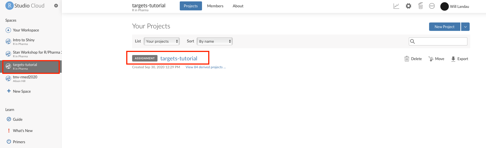
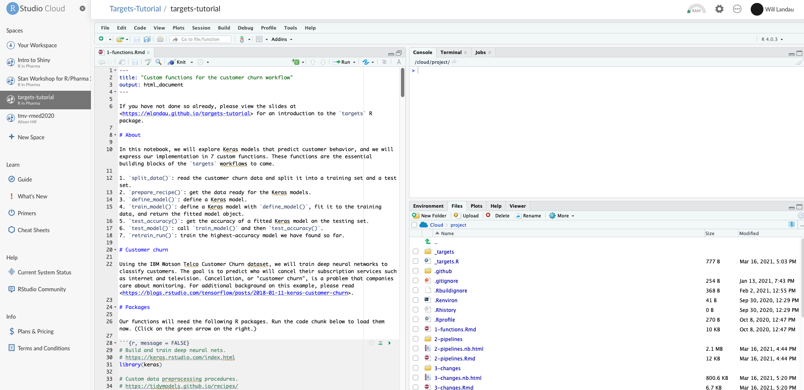

Welcome to the short course on Reproducible Computation at Scale in R with [`targets`](https://docs.ropensci.org/targets/). Through guided hands-on exercises, you will build a reproducible analysis pipeline that efficiently brings results up to date in response to changing code and data.

## Setup prework

To ensure the training runs smoothly, please access the materials in [RStudio Cloud](https://rstudio.cloud) before the day of the seminar. First, sign up for a free account at <https://rstudio.cloud> using the same email address you registered with the conference. When you log in, you will see a [shared space](https://rstudio.cloud/learn/guide#shared-spaces) called "targets-tutorial", which contains the assignment we will use for the course. (Visit <https://rstudio.cloud/learn/guide#shared-spaces> to learn more about RStudio Cloud spaces.) 

Then, please click on the assignment and verify that your browser opens an instance of RStudio Server. It may take a minute to load.

## After the short course

The materials will remain available to you after the day of the short course. Alternatively, to install the exercises locally on your computer, please visit <https://github.com/wlandau/targets-tutorial> for the source code and instructions.

## Additional resources

The introductory slides are available at <https://wlandau.github.io/targets-tutorial/>. In addition, <https://docs.ropensci.org/targets/> links to several resources to help you continue learning [`targets`](https://docs.ropensci.org/targets/) after the short course is over.

